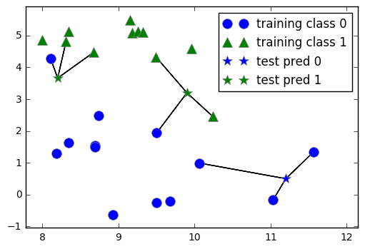
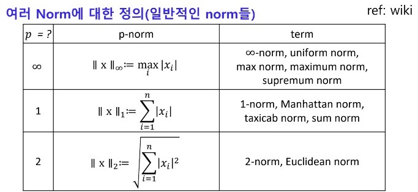
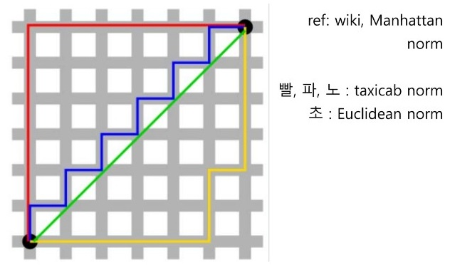

# KNN (K-nearest neighbor)

* KNN (K-nearest neighbor) classification은 근처의 k개의 데이터를 기반으로 class를 예측하는 알고리즘이다.

* **데이터에 기반하여 예측하기 때문에 data driven method라 표현한다.**

* 데이터 기반 예측이므로 **학습이 필요없다**.

## 1. 예측 방법

---

아래 이미지로 설명하겠다. 

     

* 삼각형과 동그라미는 이미 있는 데이터이다.

* 별모양은 예측하고자 하는 데이터이다.

1. k를 결정하자. (이미지에서는 k = 3)

2. 예측하고자 하는 데이터와 가까운 k개의 데이터를 고른다.

    * 거리가 같은 데이터가 여러개 있으면 랜덤하게 고른다.

3. k개의 데이터 중에 가장 많은 클래스로 예측한다.
    
    * 만약 클래스의 수가 같다면 랜덤하게 고른다.

## 2. Appendix : 거리의 정의

 

 
