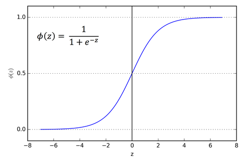
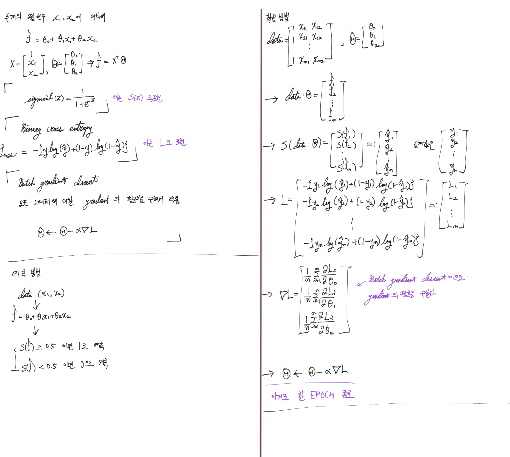
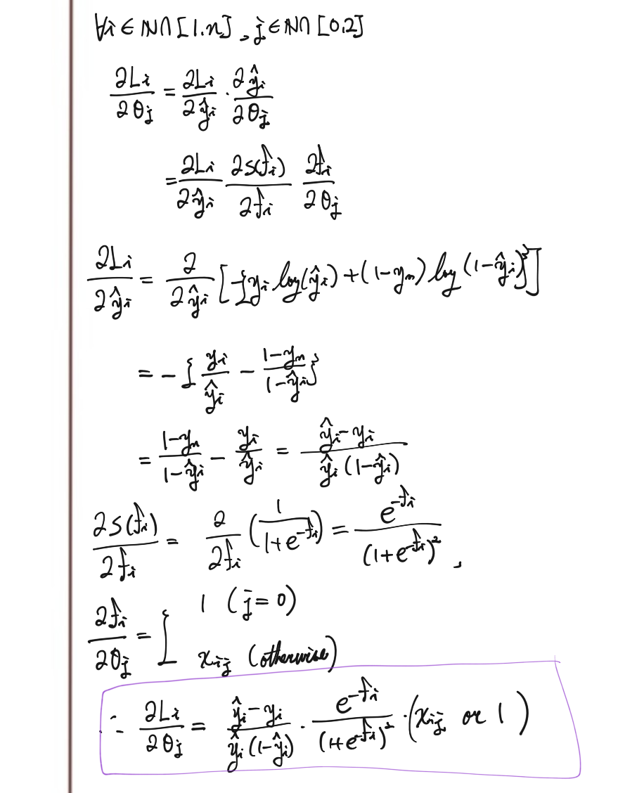

# Linear Model

## 1. 용어 설명

---

`Def`  

**피쳐 (Feature)** 

학습에 사용하고자 하는 데이터의 특성이다.  

`Ex`  

|Customer_Name  |City           |State         |Category       |Product_Name                                                    |Sales   |
|---------------|---------------|--------------|---------------|----------------------------------------------------------------|--------|
|Claire Gute    |Henderson      |Kentucky      |Furniture      |Bush Somerset Collection Bookcase                               |261.96  |
|Darrin Van Huff|Los Angeles    |California    |Office Supplies|Self-Adhesive Address Labels for Typewriters by Universal       |14.62   |
|Sean O Donnel  |Fort Lauderdale|Florida       |Furniture      |Bretford CR4500 Series Slim Rectangular Table                   |957.5775|
|Sean O Donnel  |Fort Lauderdale|Florida       |Office Supplies|Eldon Fold N Roll Cart System                                   |22.368  |
|Brosina Hoffman|Los Angeles    |California    |Technology     |Konftel 250 Conference phone - Charcoal black                   |911.424 |
|Andrew Allen   |Concord        |North Carolina|Office Supplies|Xerox 1967                                                      |15.552  |

 

**위에서, City, State, Sales 등, 열(column)을 피쳐로 사용할 수 있다.**  

---

`Def`  

**선형 모델 (Linear Model)** 

선형이란 1차식을 의미한다. 즉, 차수가 1이하인 변수로만 이루어진 수학적 모델이다.  

`Ex` 
* 선형
    * $ f(x) = x + 3 $
    * $ f(x) = 2x - 1.1 $
    * $ f(x1, x2) = 1 x_{1} + 2 x_{2} $
* 비선형
    * $ f(x) = x^{2} + 3 $
    * $ f(x) = 2x^{3} - 1.1 $
    * $ f(x1, x2) = 1 x_{1}^{2} + 2 x_{2} $

 

> $ f(x_{1}, x_{2}) = x_{1} x_{2} $ 과 같은 선형형태도 생각할 수 있지만, 이는 예측에서 사용하지 않겠다.

---

`Def`  

**편미분 (Partial Derivative)** 

다변수 함수의 경우 여러 변수에 대해 미분 가능하므로, 각각의 변수에 대한 미분을 편미분이라 한다. 

그리고, 함수 **$f(x_{1}, x_{2})$의 $x_{1}$ 대한 편미분**을 다음과 같이 표기한다. 

$$
\dfrac{\partial}{\partial x_{1}} f(x_{1}, x_{2})
$$

  

`Ex` 

* $ f(x1, x2) = 1 x_{1} + 2 x_{2} $ 라 하자.
    * $ \dfrac{\partial}{\partial x_{1}} f(x_{1}, x_{2}) = 1$
    * $ \dfrac{\partial}{\partial x_{2}} f(x_{1}, x_{2}) = 2$
* $ f(x_{1}, x_{2}) = 1 x_{1}^{2} + 2 x_{2} $ 라 하자.
    * $ \dfrac{\partial}{\partial x_{1}} f(x_{1}, x_{2}) = 2 x_{1}$
    * $ \dfrac{\partial}{\partial x_{2}} f(x_{1}, x_{2}) = 2$

---

`Def`  

**그래디언트 (Gradient)** 

다변수 함수의 각 변수에 대한 편미분을 벡터화 한 값을 그래디언트라 한다. 그리고 다음과 같이 표기한다. 

$$
\nabla f(x_{1}, x_{2}) = 
\begin{bmatrix}
   \dfrac{\partial}{\partial x_{1}} f(x_{1}, x_{2}) \\
   \dfrac{\partial}{\partial x_{2}} f(x_{1}, x_{2})
\end{bmatrix}
$$

  

`Ex` 
* $ f(x1, x2) = 1 x_{1} + 2 x_{2} $ 라 하자.
    * $\nabla f(x_{1}, x_{2}) = 
\begin{bmatrix}
    \dfrac{\partial}{\partial x_{1}} f(x_{1}, x_{2}) \\
    \dfrac{\partial}{\partial x_{2}} f(x_{1}, x_{2})
\end{bmatrix}
 = \begin{bmatrix}
    1\\
    2
\end{bmatrix}$
* $ f(x_{1}, x_{2}) = 1 x_{1}^{2} + 2 x_{2} $ 라 하자.
    * $\nabla f(x_{1}, x_{2}) = 
\begin{bmatrix}
    2 x_{1}\\
    2
\end{bmatrix}$

> 그래디언트는 n차원 그래프의 기울기와 같은 의미를 가지는데, 그 이유는 그래디언트 벡터는 그래프를 보면 함수의 위로 올라가는 방향을 가지기 때문이다. 다음 그림을 참고하자.
> 
  

---

## 2. 예측 방법

 

이미 학습된 선형모델이 이미 있다고 가정하고 예측의 흐름을 보자.   

|몸무게(kg)|꼬리 길이(cm)|강아지(=1) 또는 고양이(=0)|
|----------|-------------|--------------------------|
|2.1       |20           |1                         |
|1.4       |35.5         |0                         |

 

**몸무게와, 꼬리 길이을 피쳐로 사용하여, 강이지인지 고양이인지 예측하자.**  

그리고, 다음과 같은 선형 모델을 생각하자.  

$$
f(x_{1}, x_{2}) = \theta_{0} + \theta_{1} x_{1} + \theta_{2} x_{2}
$$

 

$x_{1}$는 몸무게, $x_{2}$는 꼬리 길이이다. 

> $\theta_{0}, \theta_{1}, \theta_{2}$는 학습된 값이다.

 

그러면 예측 순서는 다음과 같다.  

1. 데이터로 f 값을 계산한다.

2. f 가 0 이상이라면 강아지, 0 미만이라면 고양이로 예측한다.

## 학습 방법

---

`step 1`  

### $f(x_{1}, x_{2})$를 계산  

$f(x_{1}, x_{2})$를 계산한다.

---

`step 2`  

### Sigmoid 함수에 전에 계산된 값을 넣어서 계산  

Sigmoid 함수는 다음과 같다.  

$$
sigmoid(x) = \dfrac{1}{1 + e^{-x}}
$$

 

* 이 값을 "강아지일 **확률**"이라는 관점으로 볼 수도 있다.

* 만약 이 값으로 예측할 경우, 0.5 이상은 강아지, 0.5 미만은 고양으로 예측한다.

  

    

---

`step 3`  

### Binary Cross Entropy를 사용해, 얻어진 확률값으로부터 로스를 구한다.  

Binary Cross Entropy는 다음과 같다.  

$$
L = -\{y \cdot log (\hat{y}) + (1 - y) \cdot log (1 - \hat{y})\} 
$$

 

* $\hat{y}$: 모델에서 얻어진 확률값

* $y$: 데이터에 있는 실제 값

* 만약 답이 강아지인 경우 $ (y = 1) $

    * $ L = -log (\hat{y}) $

    * 강이지일 확률이 1에 가까우면 ($\hat{y}$ 이 1에 가까우면) 

        * 로스는 0에 가까워진다. ($L$ 이 0에 가까워진다.)

    * 강이지일 확률이 0에 가까우면 ($\hat{y}$ 이 0에 가까우면) 

        * $log (\hat{y})$는 $-\inf$에 가까워 진다. 

        * 로스가 증가한다. ($L$이 증가한다.)

* 만약 답이 고양이인 경우 $ (y = 0) $

    * $ L = -log (1 - \hat{y}) $

    * 고양이일 확률이 1에 가까우면 ($\hat{y}$ 이 0에 가까우면)

        * 로스는 0에 가까워진다. ($L$ 이 0에 가까워진다.)

    * 고양이일 확률이 0에 가까우면 ($\hat{y}$ 이 1에 가까우면) 

        * $log (1 - \hat{y})$는 $-\inf$에 가까워 진다.

        * 로스가 증가한다. ($L$이 증가한다.)

---

`step 4`  

### Batch Gradient Descent 를 사용해서 $\theta_{0}, \theta_{1}, \theta_{2}$ 수정하기

Batch Gradient Descent의 업데이트 식은 다음과 같다.  

$$
\begin{bmatrix}
    \theta_{0}\\
    \theta_{1}\\
    \theta_{2} 
\end{bmatrix} \leftarrow
\begin{bmatrix}
    \theta_{0}\\
    \theta_{1}\\
    \theta_{2} 
\end{bmatrix}
- \alpha \nabla L
$$

 

* $\alpha$ (*learning rate*): 학습의 속도를 결정하는 파라미터이다.

* $- \nabla L$에 대한 해석

    * 그래디언트의 용어 설명을 보면 그래프의 위로 올라가는 방향이다.

    * 즉, $\nabla L$은 로스가 증가하는 방향이다.

    * 따라서 $-\nabla L$은 로스가 떨어지는 방향이다.

    * Batch Gradient Descent 이므로 $\nabla L$은, 모든 데이터를 통해서 얻어진 그래디언트의 평균값을 사용한다.

  

**즉, Batch Gradient Descent란 주어진 데이터에서 로스가 줄어들도록 $\theta_{0}, \theta_{1}, \theta_{2}$를 수정하는 알고리즘이다.**

---

## 3. Appendix: 상세한 수학적 내용 

 
 
